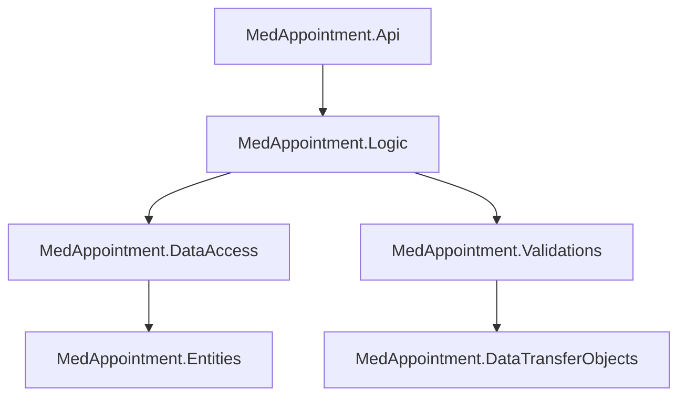
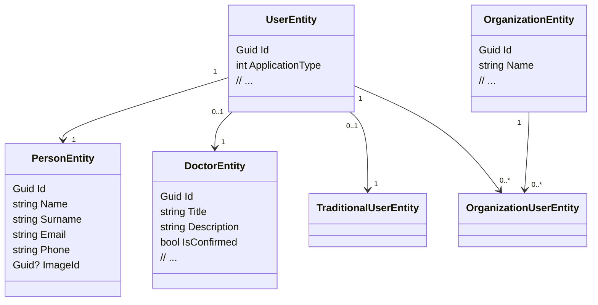

### Ümumi Arxitektura Baxışı

**MedAppointment** həllində arxitektura klassik **Layered Architecture (qat-qat arxitektura)** üzərində qurulub və .NET 9, EF Core, AutoMapper, FluentValidation, JWT və Serilog kimi müasir texnologiyalardan istifadə edir. Layihə yaxşı ayrılmış qatlara malikdir və hər qatın məsuliyyəti aydındır.

---

### Layihələr və Rolları

| Layihə | Rol | Əsas məzmun |
|--------|-----|-------------|
| **MedAppointment.Api** | API qat | ASP.NET Core Web API, Controller-lər, Auth, Swagger, giriş nöqtəsi |
| **MedAppointment.Logic** | Biznes məntiq | Servis-lər, Unit of Work istifadəsi, AutoMapper, Result pattern |
| **MedAppointment.DataAccess** | Data access | EF Core DbContext, Repository-lər, Unit of Work, SQL Server |
| **MedAppointment.Entities** | Domain model | `*Entity` POCO-lar, `BaseEntity`, navigation-lar |
| **MedAppointment.DataTransferObjects** | DTO qat | Request/Response DTO-lar, Enum-lar, Pagination modelləri |
| **MedAppointment.Validations** | Validasiya | FluentValidation validator-ları, ümumi validation bazaları |

#### Asılılıqlar diaqramı

---

### Əsas Arxitektura Pattern-ləri

#### 1. Layered Architecture

- **Presentasiya qatı**: `MedAppointment.Api` – HTTP səviyyəsi, routing, status kodlar, auth/roles, Swagger.
- **Biznes qatı**: `MedAppointment.Logic` – domen qaydaları, servis-lər, result qaytarmaq, validator çağırmaq, mapper istifadə etmək.
- **Data qatı**: `MedAppointment.DataAccess` + `MedAppointment.Entities` – EF Core, Repository-lər, Unit of Work, Entity-lər.
- **DTO & Validation qatı**: `MedAppointment.DataTransferObjects` + `MedAppointment.Validations`.

**Qayda**: Controller heç vaxt birbaşa `DbContext` və ya entity-lərlə işləməməlidir; yalnız servis interfeyslərinə müraciət etməlidir.

#### 2. Repository Pattern

- Generic repository: `IGenericRepository<TEntity>` – CRUD əməliyyatları, soft delete (`IsDeleted`).
- Domen üzrə spesifik repository-lər generic-dən miras alır (məsələn, Doctor, Appointment və s.).
- EF Core implementasiyası `EfGenericRepository<TEntity>` içindədir.

**Qayda**:
- Yeni domen üçün əvvəlcə `Entity` yaradılır, sonra ona uyğun `I...Repository` interfeysi + EF implementasiyası yaradılır.
- Servis-lər içində heç vaxt `DbContext` birbaşa istifadə olunmur, həmişə Repository və Unit of Work ilə işlənir.

#### 3. Unit of Work Pattern

Unit of Work domenlərə görə parçalanıb:

- `IUnitOfClient` – User, Doctor, Person, Admin, Organization və s.
- `IUnitOfClassifier` – Currency, PaymentType, Period, Specialty.
- `IUnitOfSecurity` – Session, Token, Device, TraditionalUser.
- `IUnitOfService` – Appointment, DayPlan, PeriodPlan.
- `IUnitOfCommunication` – Chat, ChatHistory, Meet.
- `IUnitOfPayment` – Payment.
- `IUnitOfFile` – Image.

Hər UoW:
- Müvafiq repository-ləri ekspoz edir.
- Ortak `DbContext`-i paylaşır.
- `SaveChanges()` / `SaveChangesAsync()` vasitəsilə transaction nəzarəti verir.

**Qayda**:
- Bir servis yalnız ehtiyac duyduğu UoW interfeysini constructor-da istəməlidir (məs: `IDoctorService` → `IUnitOfClient`).
- Transaction və `SaveChanges` həmişə UoW üzərindən getməlidir.

#### 4. Service Layer + Result Pattern

- Bütün biznes əməliyyatları `Logic` layindəki servis-lər vasitəsilə icra olunur:
  - Məs: `ICurrencyService`, `IDoctorService`, `ILoginService` və s.
- Tipik servis axını:
  1. DTO qəbul edir.
  2. FluentValidation ilə validasiya edir.
  3. Repository/UoW vasitəsilə data qatına müraciət edir.
  4. Entity ↔ DTO mapping (AutoMapper) edir.
  5. `Result<T>` və ya `Result` qaytarır.

`Result` və `Result<TModel>` pattern-i:
- Http status code, mesajlar, error siyahısı, success flag və s. saxlayır.
- Validation error-ları üçün `SetFluentValidationAndBadRequest()` kimi helper-lərdən istifadə olunur.

**Qayda**:
- Servis method-ları heç vaxt `IActionResult` və ya `null` qaytarmamalıdır; həmişə `Result`/`Result<T>` qaytarmalıdır.
- Controller-lər servis nəticələrini `CustomResult()` tipli helper vasitəsilə HTTP cavabına çevirir.

#### 5. DTO Pattern

- Input və output modelləri entity-lərdən tam ayrıdır:
  - Input: `*CreateDto`, `*UpdateDto`, `*RegisterDto`, `*LoginDto`.
  - Output: `*Dto`.
- Pagination:
  - Request: `PaginationQueryDto`.
  - Response: `PagedResultDto<T>`.

**Qayda**:
- Controller-lərdə heç vaxt entity istifadə etmə; həmişə DTO-larla işlət.
- Servis-lər xaricə (API qatına) DTO qaytarır, entity deyil.

#### 6. Validation Pattern (FluentValidation)

- Bütün mühüm DTO-lar üçün FluentValidation validator-ları var:
  - Məs: `TraditionalUserRegisterValidation`, `CurrencyCreateValidation`, `DeviceValidation` və s.
- Bazada ümumi validator-lar:
  - `BaseValidator<T>`, `BaseClassifierValidation<T>`.
- Burada ümumi qaydalar saxlanılır:
  - Telefon formatı, email formatı, şifrə gücü, classifier `Name` / `Description` constraint-ləri və s.
- Validator-lar `AssemblyReader` və `AddValidatorsFromAssemblyContaining<AssemblyReader>()` ilə avtomatik DI-yə daxil edilir.

**Qayda**:
- Yeni DTO yaradanda, mütləq eyni strukturda ona uyğun validator da yaz.
- Servis-lər əməliyyata başlamazdan əvvəl DTO-nu FluentValidation ilə yoxlamalı və error-ları Result içində formalaşdırmalıdır.

#### 7. Mapping (AutoMapper)

- AutoMapper profilləri `Logic/Mapping` folderində saxlanılır (məs: `DoctorProfile`).
- Entity ↔ DTO mapping-lər burada konfiqurasiya olunur.
- Bəzi mapping-lərdə kontekstdən asılı və ya şərti mapping istifadə oluna bilər.

**Qayda**:
- Yeni DTO və ya Entity əlavə edəndə, mütləq uyğun mappləri AutoMapper profilinə əlavə et.
- Controller və ya servis içində manual mapping yazma, AutoMapper istifadəsini standart saxla.

#### 8. Cross-Cutting Concerns (Auth, Logging, Config)

**Auth & JWT:**
- `Microsoft.AspNetCore.Authentication.JwtBearer` ilə JWT auth.
- Refresh token HTTP-only cookie kimi saxlanılır.
- Rol-lar `RoleNames` class-ı ilə idarə olunur (`Doctor`, `OrganizationAdmin`, `SystemAdmin`).
- Token servisi access və refresh token-lərin generasiyasını, vaxtını və s. idarə edir.

**Logging (Serilog):**
- `Serilog.AspNetCore` + file-based logging (`logs/app-.log` daily rolling).
- Structured logging; error və info səviyyəsində mərkəzləşdirilmiş log.

**Konfiqurasiya:**
- `appsettings.json` – Connection string, JWT settings, file server yolları və s.
- EF Core üçün SQL Server provider (`Microsoft.EntityFrameworkCore.SqlServer`).

**Qayda**:
- Auth tələb edən endpoint-lərdə `[Authorize]` və lazım gələrsə `[Authorize(Roles = RoleNames.X)]` istifadə et.
- Şifrə, token dəyərləri kimi həssas məlumatları log-lama.

---

### Domenlər və Əsas Entity-lər

| Domen | Əsas entity-lər | Qısa izah |
|-------|------------------|-----------|
| **Client** | `UserEntity`, `PersonEntity`, `DoctorEntity`, `AdminEntity`, `OrganizationEntity`, `OrganizationUserEntity` | İstifadəçilər, həkimlər, adminlər, təşkilatlar |
| **Security** | `TraditionalUserEntity`, `SessionEntity`, `TokenEntity`, `DeviceEntity` | Auth & session idarəçiliyi, token-lər, cihazlar |
| **Service** | `AppointmentEntity`, `DayPlanEntity`, `PeriodPlanEntity` | Qəbul zamanları, planlaşdırma, schedule |
| **Classifier** | `CurrencyEntity`, `PaymentTypeEntity`, `PeriodEntity`, `SpecialtyEntity` | Lüğətlər, classifier cədvəllər |
| **Communication** | `ChatEntity`, `ChatHistoryEntity`, `MeetEntity` | Mesajlaşma və görüşlər |
| **Payment** | `PaymentEntity` | Ödəniş əməliyyatları |
| **File** | `ImageEntity` | Fayl / şəkil metadata |

#### Client domeni üçün sadə diaqram (məsələn)

---

### İstifadə Olunan Əsas Paketlər (NuGet)

#### MedAppointment.Api

- `Microsoft.AspNetCore.Authentication.JwtBearer (9.0.12)` – JWT auth.
- `Microsoft.AspNetCore.OpenApi (9.0.12)` – OpenAPI inteqrasiyası.
- `Serilog.AspNetCore (10.0.0)` – Logging.
- `Swashbuckle.AspNetCore (9.0.6)` – Swagger UI.

#### MedAppointment.DataAccess

- `Microsoft.EntityFrameworkCore (9.0.12)`
- `Microsoft.EntityFrameworkCore.SqlServer (9.0.12)`

#### MedAppointment.Logic

- `AutoMapper (12.0.1)`
- `AutoMapper.Extensions.Microsoft.DependencyInjection (12.0.1)`

#### MedAppointment.Validations

- `FluentValidation (12.1.1)`
- `FluentValidation.DependencyInjectionExtensions (12.1.1)`

---

### Gələcək Developer üçün RULE Seti

Bu qaydalar solyushion-a qoşulan növbəti developer üçün yönləndirici “konstitusiya” kimi nəzərdə tutulub.

#### Struktur və Layihə Qaydaları

- **RULE 1**: Yeni domen obyektləri üçün bu ardıcıllığa əməl et:
  1. `Entities` layində `*Entity` yarad.
  2. `DataAccess` layində:
     - `I*Repository` interfeysi (generic repo-dan miras).
     - EF implementasiyası.
     - Müvafiq Unit of Work interfeysinə bu repo-nu əlavə et.
  3. `DTOs` layində input/output DTO-ları (Create/Update/Dto).
  4. `Validations` layində FluentValidation üçün validator-lar.
  5. `Logic` layində:
     - `I*Service` interfeysi.
     - `*Service` implementasiyası.
     - AutoMapper profile-də mappləri əlavə et.
  6. `Api` layində Controller (yalnız servis-lə işləyən).

- **RULE 2**: Hər layihə yalnız öz qatına uyğun məsuliyyəti daşısın:
  - Api → HTTP/Controller/Auth.
  - Logic → Biznes qaydaları.
  - DataAccess → EF, Repository, Unit of Work.
  - Entities → Sadə POCO-lar.
  - DTOs → Xarici kontraktlar.
  - Validations → DTO qaydaları.

#### Kod Yazarkən Stil və Pattern Qaydaları

- **RULE 3 – Naming**:
  - Entity → `*Entity` (məs: `AppointmentEntity`).
  - DTO → `*Dto`, `*CreateDto`, `*UpdateDto`, `*RegisterDto`, `*LoginDto`.
  - Service interface → `I*Service` / implementasiya `*Service`.
  - Repository interface → `I*Repository` / implementasiya `*Repository`.
  - Validator → `*Validation`.

- **RULE 4 – Soft Delete**:
  - `IsDeleted` flag-lı entity-lərdə silmə əməliyyatını heç vaxt `DbContext.Remove` ilə etmə; repository səviyyəsində soft-delete mexanizmini istifadə et.
  - Yeni entity-lər üçün də soft delete ehtiyacı varsa, `BaseEntity`-dən miras al.

- **RULE 5 – Async-first**:
  - Bütün IO-bound əməliyyatları async yaz (`Task<Result<T>>`, `Task<Result>`).
  - EF çağırışlarında `ToListAsync`, `FirstOrDefaultAsync` və s. istifadə et.

- **RULE 6 – Validation Usage**:
  - Hər yeni DTO üçün müvafiq FluentValidation class-ı yaz.
  - Servis-lər içində validator-ları inject edib, əməliyyata başlamazdan əvvəl `ValidateAsync` çağır.
  - Validation error-larını `Result` obyektinə helper-lərlə əlavə et.

- **RULE 7 – Mapping**:
  - Manual mapping yazmağa meyilli olsan belə, onu AutoMapper profilinə daşı.
  - Mümkün qədər `ProjectTo<TDto>` istifadə et ki, lazımsız property-lər yüklənməsin.

- **RULE 8 – Result Pattern**:
  - Servis heç vaxt `null` qaytarmasın; hər zaman `Result`/`Result<T>` qaytarsın.
  - Error hallarında həm `StatusCode`, həm də `Messages` doldur.

#### Security və API Qaydaları

- **RULE 9 – Auth & Roles**:
  - Public/anonim endpoint-lər istisna olmaqla `[Authorize]` və rola görə `[Authorize(Roles = RoleNames.X)]` istifadə et.
  - Refresh token-lər yalnız HTTP-only cookie vasitəsilə verilməlidir (JS-ə heç vaxt açma).

- **RULE 10 – Error Handling**:
  - Exception-ları mümkün qədər global middleware / filter səviyyəsində tut.
  - Serilog ilə kritik domain error-larını log-la, amma həssas dəyərləri filtr et.

---

### Yeni Developer üçün Diqqət Ediləsi Məqamlar

- **UnitOfWork-lərin çoxluğu**: Hər domenin ayrıca UoW-i var; hansı servis üçün hansını istifadə etdiyini düzgün seçmək lazımdır.
- **Soft delete filtr-ləri**: Şərti sorğularda `IsDeleted == false` filtrinin repo səviyyəsində artıq tətbiq olunduğunu nəzərə al.
- **Result pattern konsistensiyası**: Bütün servislərin cavab formatı oxşardır; bunu pozma, əks halda Api qatında cavabların idarəsi çətinləşə bilər.
- **Validation-ların manual çağırılması**: Validation ASP.NET pipeline-da deyil, servis səviyyəsində manual çağırılır. Yəni controller-lərdə `ModelState.IsValid`-ə tam güvənmə.
- **AutoMapper konfiqurasiyası**: Profil-lərə əlavə etdiyin mapplərin düzgün olduğuna əmin ol; səhvlər run-time-da ortaya çıxır.

---

Bu fayl `Info/General.md` kimi saxlanılıb və layihəyə qoşulan hər kəs üçün ümumi texniki “başlanğıc bələdçi” rolunu oynaya bilər.

